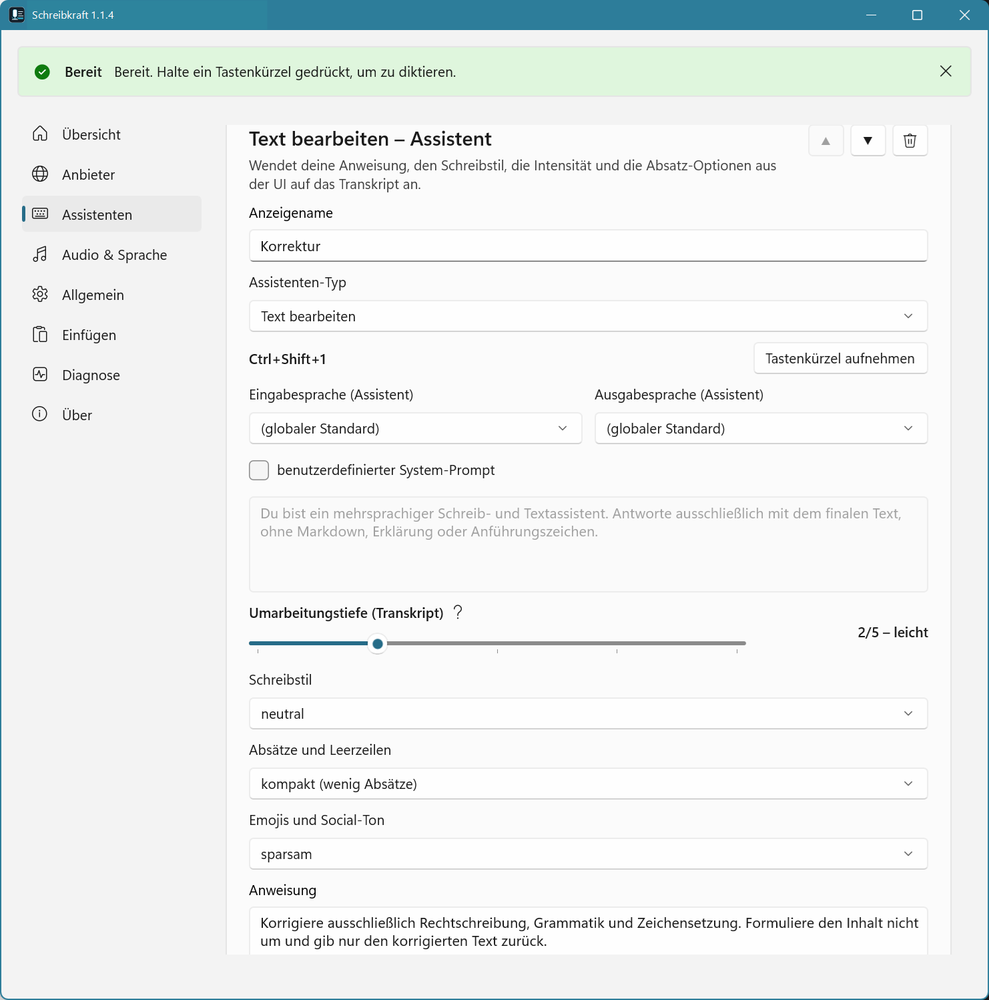

# Schreibkraft

Schreibkraft ist eine Windows-Desktop-App für gesprochene Eingabe bei gedrückter Taste (Push-to-Talk). Audio wird lokal aufgenommen, in der Cloud transkribiert, per KI verarbeitet und anschließend in das aktuell aktive Eingabefeld eingefügt. Du legst dir beliebig viele Assistenten an, jeder mit eigenem Typ, Tastenkürzel, Anweisung, Intensität und Schreibstil.

**Aktuelle Version:** 1.1.4

**Hinweis:** Die App und der zugehörige Quellcode wurden wesentlich mit KI-gestützter Entwicklung (z. B. Assistent in der IDE) erstellt und von Menschen geprüft und freigegeben.



## Voraussetzungen

- Windows 10/11 x64
- .NET SDK 10.0.202 oder neuer
- Visual Studio mit .NET Desktop Development und Windows App SDK-Unterstützung
- Mikrofonzugriff in den Windows-Datenschutzeinstellungen
- API-Schlüssel für einen bekannten Anbieter von Transkription und KI

## Start in Visual Studio

1. `Schreibkraft.sln` öffnen.
2. `Schreibkraft` als Startprojekt wählen.
3. Konfiguration `Debug|x64` verwenden.
4. NuGet-Restore abwarten und mit F5 starten.

Beim ersten Start übernimmt Schreibkraft fehlende Dateien aus dem früheren lokalen Datenordner nach `%LOCALAPPDATA%\Schreibkraft`, ohne bereits vorhandene Schreibkraft-Dateien zu überschreiben. Fehlen danach weiterhin Settings, werden `%LOCALAPPDATA%\Schreibkraft\settings.json` und `%LOCALAPPDATA%\Schreibkraft\logs` erzeugt sowie die drei Standard-Assistenten angelegt. Es gibt keinen First-Run-Assistenten. Fehlen Pflichtwerte, öffnet die App das Einstellungsfenster mit dem Status `Einrichtung erforderlich`.

Die Bereiche `Transkription` und `KI` enthalten jeweils Anbieter, Modell und API-Schlüssel. Die App kennt die Endpunkte der unterstützten Anbieter intern; normale Nutzer müssen keine URLs eintragen.

## Assistenten und Typen

Schreibkraft kennt drei Assistenten-Typen. Du kannst beliebig viele Assistenten pro Typ anlegen — etwa zwei „Text bearbeiten"-Assistenten mit unterschiedlicher Tiefe oder mehrere Antwort-Vorlagen für verschiedene Aufgaben.

| Typ | Sprachinput wird verstanden als | Quelle |
|---|---|---|
| Text bearbeiten | gesprochener Text, der korrigiert, geglättet oder umformuliert werden soll | nur Sprache |
| Text generieren | Anweisung, aus der die KI einen neuen Text erzeugt | nur Sprache |
| Antwort (Zwischenablage) | Anweisung, mit der die KI auf den Zwischenablage-Text antwortet | Sprache + Clipboard |

Standard-Tastenkürzel beim ersten Start: `Ctrl+Shift+1` … `Ctrl+Shift+3`. Du kannst sie pro Assistent frei vergeben.

## Bedienung

Schreibkraft läuft primär im Infobereich. Das Tray-Menü enthält `Aktiv` und `Beenden`. Ist `Aktiv` nicht angehakt, starten keine neuen Aufnahmen bei gedrückter Taste.

Tastenkürzel gedrückt halten, sprechen, loslassen. Die App stoppt die Aufnahme, transkribiert, verarbeitet und fügt den Text standardmäßig per **direktem Tippen (SendInput)** ein. Du kannst die Einfügemethode in den Einstellungen auf Einfügen über die Zwischenablage umstellen. Beim Typ „Antwort (Zwischenablage)" wird der Zwischenablage-Inhalt zum Zeitpunkt des Hotkey-Drucks als Quelltext mitgegeben — ist die Zwischenablage leer, startet keine Aufnahme.

Im Bereich `Assistenten` der Einstellungen siehst du alle angelegten Assistenten. Pro Assistent kannst du Name, Typ-Anzeige, Tastenkürzel, Intensität, Schreibstil und Anweisung anpassen. Über `+ Assistent hinzufügen` legst du neue Einträge mit dem gewünschten Typ an, mit `Löschen` wieder entfernen (mindestens einer muss bestehen bleiben).

Im Bereich `Pipeline` kannst du bei Fehlern optionale Wiederholungsversuche (0–5) für Transkription, KI-Verarbeitung und Zwischenablage-Einfügen konfigurieren. Schlägt die KI-Verarbeitung nach den Versuchen fehl, wird das Transkript eingefügt.

## Datenschutz

Standardmäßig werden keine Audiodaten, Transkripte oder finalen Texte protokolliert. Protokolle enthalten technische Statusinformationen und Fehlerhinweise. API-Schlüssel werden unter Windows per DPAPI für den aktuellen Benutzer verschlüsselt.

Audio wird zur Transkription an den konfigurierten Cloud-Anbieter gesendet. Transkripte werden zur KI-Verarbeitung an den konfigurierten KI-Anbieter gesendet. Beim Typ „Antwort (Zwischenablage)" wird zusätzlich der Inhalt der Zwischenablage zum Zeitpunkt des Hotkey-Drucks an den KI-Anbieter gesendet.

## Build und Tests

```powershell
dotnet restore
dotnet build .\Schreibkraft.sln -c Debug
dotnet test .\Schreibkraft.sln -c Debug
.\Build.ps1
```

## Installer

Empfohlener Nutzerweg: `.\Build.ps1` erzeugt den App-Ordner unter **`artifacts\publish\Schreibkraft`**. Wenn Inno Setup installiert ist, entsteht zusätzlich **`artifacts\installer\Schreibkraft-Setup-<Version>.exe`**. Diese Setup-Datei installiert Schreibkraft nach `%LOCALAPPDATA%\Programs\Schreibkraft`, legt den Startmenüeintrag an und registriert die App normal in den Windows-Einstellungen unter `Installierte Apps`, inklusive Deinstallation.

```powershell
winget install JRSoftware.InnoSetup
.\Build.ps1
```

Der Setup-Installer prüft beim Installieren **Windows App Runtime 1.8 (x64)** und **.NET 10 Windows Desktop Runtime**. Fehlen sie, versucht er die Installation per **winget**; ohne winget werden die Microsoft-Installer direkt geladen. Die Runtime-Installer können **UAC** anzeigen.

Der bisherige Skriptweg bleibt als Entwickler- und Fallback-Variante erhalten: `.\Install.ps1` kopiert den Build nach `%LOCALAPPDATA%\Programs\Schreibkraft`, `.\Uninstall.ps1` entfernt diese Skriptinstallation; `-RemoveUserData` entfernt zusätzlich `%LOCALAPPDATA%\Schreibkraft` (Settings + Logs). Für normale Weitergabe ist die Setup-Datei vorzuziehen, weil sie in den Windows-Einstellungen sichtbar und dort deinstallierbar ist.

## GitHub-Sync und Release

Für GitHub-Veröffentlichungen wird die Setup-Datei als Release-Asset hochgeladen:

```powershell
.\Build.ps1
.\Sync-GitHub.ps1 -Release
```

Das nutzt die `AppVersion` aus `Directory.Build.props`, erstellt/aktualisiert den Tag `v<AppVersion>` und lädt `artifacts\installer\Schreibkraft-Setup-<Version>.exe` in das GitHub Release hoch. Das Skript fragt `Draft?` und `Pre-Release?` direkt mit ja/nein ab. Voraussetzung: GitHub CLI (`gh`) ist installiert und angemeldet; falls sie fehlt, versucht das Skript die Installation.

## Bekannte Einschränkungen

- Die erste Provider-Implementierung nutzt intern bekannte OpenAI-kompatible HTTP-Endpunkte. Nutzer wählen Anbieter und Modell, tragen aber keine URLs ein.
- Ein echter STT-Rundlauf muss manuell mit Mikrofon und API-Schlüssel geprüft werden.
- Standardmäßig wird direkt per `SendInput` getippt. Das Einfügen über die Zwischenablage ist als alternative Einfügemethode verfügbar.
- Einfügen in erhöhte Zielanwendungen kann scheitern, wenn Schreibkraft nicht mit denselben Rechten läuft.
- Die App erzeugt statische Tray-Icons lokal im Projekt; MSIX-Packaging und Signierung sind noch nicht umgesetzt.
- Solution-Datei `Schreibkraft.sln`, Bibliotheken `Schreibkraft.Core` und `Schreibkraft.Infrastructure` (intern app-agnostisch).
